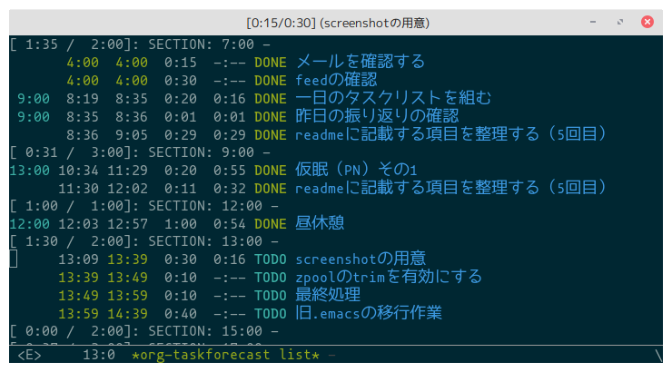

# org-taskforecast

Time management tool for today's tasks showing them with estimated start/end time.

This package is based on the time management method [TaskChute](https://taskchute.net/).
However this package implements only a few features, not all of the original TaskChute.

Make a list of tasks for today and show the list with todo state, estimated start and end time of task.
You can see what task you're working on, what tasks you've done today with time log and rest tasks for today with estimated start and end time.
And you can also manipulate tasks in the list like org-agenda.

This package uses org-id to find an org heading.
So `ID` property of an org heading is set as needed.

**WARNING:** This package is in early stage of development, possibly introduce some breaking changes.

## Screenshot



## Requirements

- Emacs 25.1 or later
- [dash](https://github.com/magnars/dash.el)
- [dash-functional](https://github.com/magnars/dash.el)
- [s](https://github.com/magnars/s.el)
- [org-ql](https://github.com/alphapapa/org-ql)

## Installation

TODO: register to MELPA

Currently this package is not registered in any emacs lisp package archives.
So manual installing is needed.

Here is an expamle to install via package.el manually.
To evaluate the code below, you can install this package from github directory.

```emacs-lisp
(with-temp-buffer
  (url-insert-file-contents "https://raw.githubusercontent.com/HKey/org-taskforecast/master/org-taskforecast.el")
  (package-install-from-buffer))
```

## Basic usage

The basic usage of this package is making a task list for today and show the list.

1. Register tasks for today to make the list:

   `M-x org-taskforecast-register-tasks-for-today` to register tasks to the list from your org-agenda files.
   This command registers tasks whose SCHEDULED or DEADLINE is set to today or before.  
   **NOTE:** Currently this command does not consider prewarning of DEADLINE of a task.

2. Show the task list for today:

   `M-x org-taskforecast-list` to show the list.

   Then you can see the tasks for today with todo state, SCHEDULED/DEADLINE time, effort and logged or estimated start and end time.
   Also you can manipulate tasks, e.g. changing todo state, moving up/down in the list and setting effort.  
   See [Key Bindings](#key-bindings) for what you can do in the list.

### Date on org-taskforecast

You can set the delimiter time of a day.
Based on the delimiter time, the date of a task specified by SCHEDULED or DEADLINE is determined.

To change the delimiter time, set `org-taskforecast-day-start` to an integer in HHMM format.

```emacs-lisp
;; 4:00 am (today) - 3:59 am (tomorrow)
(setq org-taskforecast-day-start 0400)
```

In this package, 24 hours from the time of `org-taskforecast-day-start` on a certain day is treated as the day.
However, if the time is not specified in the timestamp of SCHEDULED or DEADLINE, the date is treated as is.

Examples:

| day-start | timestamp                | date on org-taskforecast |
|-----------|--------------------------|--------------------------|
|      0000 | `<2020-04-01 Wed>`       |               2020-04-01 |
|      0000 | `<2020-04-01 Wed 00:00>` |               2020-04-01 |
|      0400 | `<2020-04-01 Wed>`       |               2020-04-01 |
|      0400 | `<2020-04-01 Wed 00:00>` |               2020-03-31 |

## Architecture

TODO

```
        [org-taskforecast-list] ----+
                 ^                  |
                 |                  |
      show tasks |                  |
                 |                  | modify tasks
                 |                  | * change todo
        [daily task list file]      | * clock-in/out
                 ^                  | * set effort
                 |                  | * ...
  register tasks |                  |
                 |                  |
                 |                  |
           [org agenda files] <-----+
```

## List mode - `org-taskforecast-list-mode`

Show the task list for today with some information.
You can manipulate the list, e.g. changing the order and removing an entry.
Also you can manipulate the tasks like org-agenda.

### Key bindings

#### Manipulate list

| key | command                                 |
|-----|-----------------------------------------|
| `g` | `org-taskforecast-list-refresh`         |
| `n` | `org-taskforecast-list-next-line`       |
| `p` | `org-taskforecast-list-previous-line`   |
| `U` | `org-taskforecast-list-move-entry-up`   |
| `D` | `org-taskforecast-list-move-entry-down` |
| `s` | `org-save-all-org-buffers`              |
| `P` | `org-taskforecast-list-postpone-link`   |
| `d` | `org-taskforecast-list-remove-entry`    |
| `q` | `org-taskforecast-list-quit`            |

#### Manipulate task

| key       | command                                        |
|-----------|------------------------------------------------|
| `I`       | `org-taskforecast-list-clock-in`               |
| `O`       | `org-taskforecast-list-clock-out`              |
| `t`       | `org-taskforecast-list-todo`                   |
| `e`       | `org-taskforecast-list-set-effort`             |
| `RET`     | `org-taskforecast-list-goto-task`              |
| `C-c C-s` | `org-taskforecast-list-schedule`               |
| `C-c C-d` | `org-taskforecast-list-deadline`               |
| `z`       | `org-taskforecast-list-add-note`               |
| `S`       | `org-taskforecast-list-set-default-section-id` |

#### Control formatter

| key  | command                                                 |
|------|---------------------------------------------------------|
| `vS` | `org-taskforecast-list-tlfmt-scheduled-time-toggle`     |
| `vf` | `org-taskforecast-list-tlfmt-effort-toggle`             |
| `vs` | `org-taskforecast-list-tlfmt-start-toggle`              |
| `ve` | `org-taskforecast-list-tlfmt-end-toggle`                |
| `vc` | `org-taskforecast-list-tlfmt-clock-toggle`              |
| `vd` | `org-taskforecast-list-tlfmt-default-section-id-toggle` |

## Tracking mode

TODO

## Interruption

TODO

## Versioning

The versioning of org-taskforecast follows [Semantic Versioning 2.0.0](https://semver.org/spec/v2.0.0.html)
