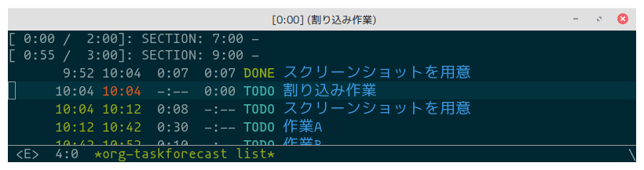

# org-taskforecast

Time management tool for today's tasks showing them with estimated start/end time.

This package is based on the time management method [TaskChute](https://taskchute.net/).
However this package implements only a few features, not all of the original TaskChute.

Make a list of tasks for today and show the list with todo state, estimated start and end time of task.
You can see what task you're working on, what tasks you've done today with time log and rest tasks for today with estimated start and end time.
And you can also manipulate tasks in the list like org-agenda.

This package uses org-id to find an org heading.
So `ID` property of an org heading is set as needed.

**WARNING:** This package is in early stage of development, possibly introduce some breaking changes.

## Screenshot


## Table of contents

<!--ts-->
   * [org-taskforecast](#org-taskforecast)
      * [Screenshot](#screenshot)
      * [Table of contents](#table-of-contents)
      * [Requirements](#requirements)
      * [Installation](#installation)
      * [Basic usage](#basic-usage)
         * [Date on org-taskforecast](#date-on-org-taskforecast)
      * [Difference from org-agenda](#difference-from-org-agenda)
         * [Why manual registration](#why-manual-registration)
         * [Why the daily task list file is written in org-mode](#why-the-daily-task-list-file-is-written-in-org-mode)
      * [Section](#section)
         * [Define sections](#define-sections)
         * [Generate section headings](#generate-section-headings)
         * [Default section](#default-section)
      * [List mode - org-taskforecast-list-mode](#list-mode---org-taskforecast-list-mode)
         * [Key bindings](#key-bindings)
            * [Manipulate list](#manipulate-list)
            * [Manipulate task](#manipulate-task)
            * [Control formatter](#control-formatter)
      * [Tracking mode - org-taskforecast-track-mode](#tracking-mode---org-taskforecast-track-mode)
         * [Interruption](#interruption)
      * [Versioning](#versioning)


<!--te-->

## Requirements

- Emacs 26.1 or later
- [dash](https://github.com/magnars/dash.el)
- [dash-functional](https://github.com/magnars/dash.el)
- [s](https://github.com/magnars/s.el)
- [org-ql](https://github.com/alphapapa/org-ql)

## Installation

TODO: register to MELPA

Currently this package is not registered in any emacs lisp package archives.
So manual installing is needed.

Here is an example to install via package.el manually.
To evaluate the code below, you can install this package from github directory.

```emacs-lisp
(with-temp-buffer
  (url-insert-file-contents "https://raw.githubusercontent.com/HKey/org-taskforecast/master/org-taskforecast.el")
  (package-install-from-buffer))
```

## Basic usage

The basic usage of this package is making a task list for today and show the list.

1. Register tasks for today to make the list:

   `M-x org-taskforecast-register-tasks-for-today` to register tasks to the list from your org-agenda files.
   This command registers tasks whose SCHEDULED or DEADLINE is set to today or before.  
   **NOTE:** Currently this command does not consider prewarning of DEADLINE of a task.

2. Show the task list for today:

   `M-x org-taskforecast-list` to show the list.

   Then you can see the tasks for today with todo state, SCHEDULED/DEADLINE time, effort and logged or estimated start and end time.
   Also you can manipulate tasks, e.g. changing todo state, moving up/down in the list and setting effort.  
   See [Key Bindings](#key-bindings) for what you can do in the list.

### Date on org-taskforecast

You can set the delimiter time of a day.
Based on the delimiter time, the date of a task specified by SCHEDULED or DEADLINE is determined.

To change the delimiter time, set `org-taskforecast-day-start` to an integer in HHMM format.

```emacs-lisp
;; 4:00 am (today) - 3:59 am (tomorrow)
(setq org-taskforecast-day-start 0400)
```

In this package, 24 hours from the time of `org-taskforecast-day-start` on a certain day is treated as the day.
However, if the time is not specified in the timestamp of SCHEDULED or DEADLINE, the date is treated as is.

Examples:

| day-start | timestamp                | date on org-taskforecast |
|-----------|--------------------------|--------------------------|
|      0000 | `<2020-04-01 Wed>`       |               2020-04-01 |
|      0000 | `<2020-04-01 Wed 00:00>` |               2020-04-01 |
|      0400 | `<2020-04-01 Wed>`       |               2020-04-01 |
|      0400 | `<2020-04-01 Wed 00:00>` |               2020-03-31 |

## Difference from org-agenda

In this package, the task list for today is created by registering tasks by user not a result of searching like org-agenda.

```
        [org-taskforecast-list] ----+
                 ^                  |
                 |                  |
      show tasks |                  |
                 |                  | modify tasks
                 |                  | * change todo
        [daily task list file]      | * clock-in/out
                 ^                  | * set effort
                 |                  | * ...
  register tasks |                  |
                 |                  |
                 |                  |
           [org agenda files] <-----+
```

To register task(s), you can use following commands:

- `org-taskforecast-register-task`  
  Register a task at the current point.

- `org-taskforecast-register-tasks-for-today`  
  Register tasks from org-agenda files based on SCHEDULED and DEADLINE.

Registered tasks are contained in a daily task list file as task link headings like below:

```
* [[id:ID-OF-TASK-HEADING][TASK-TITLE]]
:PROPERTIES:
:ID:       ID-OF-TASK-LINK-HEADING
:END:
```

That file is created for each day (default is like `~/org-taskforecast/2020/2020-04/2020-04-01.org`).
`org-taskforecast-list` shows only the tasks registered in the file.

### Why manual registration

The reason of why use manual registration not searching every time is to manage the daily task list more flexible.  
The flexibility is:
- Registering and removing arbitrary tasks without any tricks (e.g. filtering by tag like "today" or "dont_show")
- Changing the order of the tasks without any tricks (e.g. setting fake scheduled time like 14:59 to put a task before other tasks scheduled at 15:00)

The purpose of this package is to simulate the tasks and the time for today.
To simulate that, it is needed that the way to keep that the daily task list contains only the tasks to do today and to keep the list in the order to begin them.

### Why the daily task list file is written in org-mode

The reasons are below:

- To make editing the list easier.  
  For example, killing and yanking helps you to change the order of many tasks.

- To make the list readable without `org-taskforecast-list`.  
  You can see the tasks for today and jump to the task from a task link heading in that file.

## Section

Section divides the time of a day and makes it easy to check the total effort of the registered tasks for a section.  
Sections are showed in `org-taskforecast-list` like below:


The default format is `[TOTAL-EFFORT / SECTION-DURATION]: TITLE`.

A section is expressed as a section heading in a daily task list file.
The tasks between a section heading and the next section heading are the elements of that section.

### Define sections

To define sections, you need to set `org-taskforecast-sections` like below:

```emacs-lisp
(setq org-taskforecast-sections
      ’(("morning"   0600)
        ("daytime-a" 0900)
        ("noon"      1200 "Lunch and nap")
        ("daytime-b" 1300)
        ("evening"   1700)
        ("night"     2000 "Reading books")))
```

Each element of `org-taskforecast-sections` is `(ID START-TIME &optional DESCRIPTION)`.
- `ID` is a section id used to set the default section of a task (see [Default section](#default-section))
- `START-TIME` is the start time of a section in HHMM format
- `DESCRIPTION` is a description string (optional)

`org-taskforecast-sections` is a template of sections.
So to use the sections for today, you need to generate section headings into a daily task list file.

### Generate section headings

You can generate section headings by `M-x org-taskforecast-generate-sections`.
However if you set `org-taskforecast-sections` and the section headings are not generated for today yet, `org-taskforecast-register-tasks-for-today` calls that command.
So you use `org-taskforecast-register-tasks-for-today`, usually do not need to call `org-taskforecast-generate-sections` manually.

### Default section

Default section is a hint where a task link should be placed.
When a task is registered, it will be placed into its default section if the section exists.
If a task has no default section, this package derives the default section corresponds to its time of SCHEDULED or DEADLINE.
To set default section, call `org-taskforecast-set-default-section-id` at the target heading in org-mode buffer or call `org-taskforecast-list-set-default-section-id` in `org-taskforecast-list` buffer.

## List mode - `org-taskforecast-list-mode`

Show the task list for today with some information.
You can manipulate the list, e.g. changing the order and removing an entry.
Also you can manipulate the tasks like org-agenda.

### Key bindings

#### Manipulate list

| key | command                                 |
|-----|-----------------------------------------|
| `g` | `org-taskforecast-list-refresh`         |
| `n` | `org-taskforecast-list-next-line`       |
| `p` | `org-taskforecast-list-previous-line`   |
| `U` | `org-taskforecast-list-move-entry-up`   |
| `D` | `org-taskforecast-list-move-entry-down` |
| `s` | `org-save-all-org-buffers`              |
| `P` | `org-taskforecast-list-postpone-link`   |
| `d` | `org-taskforecast-list-remove-entry`    |
| `q` | `org-taskforecast-list-quit`            |

#### Manipulate task

| key       | command                                        |
|-----------|------------------------------------------------|
| `I`       | `org-taskforecast-list-clock-in`               |
| `O`       | `org-taskforecast-list-clock-out`              |
| `t`       | `org-taskforecast-list-todo`                   |
| `e`       | `org-taskforecast-list-set-effort`             |
| `RET`     | `org-taskforecast-list-goto-task`              |
| `TAB`     | `org-taskforecast-list-goto-task-other-window` |
| `C-c C-s` | `org-taskforecast-list-schedule`               |
| `C-c C-d` | `org-taskforecast-list-deadline`               |
| `z`       | `org-taskforecast-list-add-note`               |
| `:`       | `org-taskforecast-list-set-tags`               |
| `S`       | `org-taskforecast-list-set-default-section-id` |

#### Control formatter

| key  | command                                                 |
|------|---------------------------------------------------------|
| `vS` | `org-taskforecast-list-tlfmt-scheduled-time-toggle`     |
| `vf` | `org-taskforecast-list-tlfmt-effort-toggle`             |
| `vs` | `org-taskforecast-list-tlfmt-start-toggle`              |
| `ve` | `org-taskforecast-list-tlfmt-end-toggle`                |
| `vc` | `org-taskforecast-list-tlfmt-clock-toggle`              |
| `vd` | `org-taskforecast-list-tlfmt-default-section-id-toggle` |

## Tracking mode - `org-taskforecast-track-mode`

Automatically register a task and move it to the head of todo task links when you clock-in or change todo state to done.
This is helpful when you've forgotten to register a task or you need to do a task not planned for today.

To enable this, turn `org-taskforecast-track-mode` on in the target buffers.
This minor mode is not global minor mode, so you can control the files of target for tracking.

The recommended way to enable the minor mode is using [directory local variable](https://www.gnu.org/software/emacs/manual/html_node/emacs/Directory-Variables.html) to enable the minor mode for only files in specified directory like below:

```emacs-lisp
;; .dir-locals.el

;; enable `org-taskforecast-track-mode' for org files in this directory
((org-mode . ((eval . (when (require 'org-taskforecast nil t)
                        (org-taskforecast-track-mode 1))))))
```

### Interruption

Interruption function divides the currently working task link into two task links, worked and remaining work, when you've already started working on a task and you've clocked-in another task without getting the working task done.
And the task link of newly clocked-in task is placed the head of todo task links.
This is helpful to resume working on the task which you've worked on before switching to the interruption task.

To disable this function, set `org-taskforecast-enable-interruption` to `nil`.

before interruption:


after interruption:



- the last task is divided into two task links
- the effort is also divided
- new task is placed at the head of todo task links

## Versioning

The versioning of org-taskforecast follows [Semantic Versioning 2.0.0](https://semver.org/spec/v2.0.0.html)
